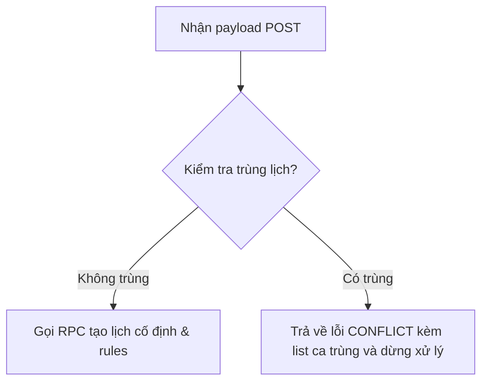

# Tài liệu Đặc tả Recurring Bookings API (v1)

Tài liệu này đặc tả chi tiết các endpoints của API Đặt lịch cố định (Recurring Bookings) tại đường dẫn `/api/v1/bookings/recurring`.

---

## 1. Cấu trúc Response chuẩn hóa

### Phản hồi Thành công
```json
{
  "success": true,
  "data": {
    "ruleId": "33333333-3333-4333-a333-333333333333",
    "bookingsCount": 6
  }
}
```

### Phản hồi Thất bại (Lỗi Trùng lịch)
Khi phát hiện có các ca đặt sân bị trùng giờ, API trả về mã lỗi `CONFLICT` (200 status với success: false) kèm theo thông tin chi tiết các ca bị trùng và ngừng xử lý:
```json
{
  "success": false,
  "error": {
    "code": "CONFLICT",
    "message": "Scheduling conflicts detected.",
    "conflicts": [
      {
        "id": "conflicted_booking_uuid",
        "start_time": "2026-07-06T01:30:00Z",
        "end_time": "2026-07-06T02:30:00Z",
        "customerName": "Nguyễn Văn B"
      }
    ]
  }
}
```

---

## 2. Bảo mật & Phân quyền (RBAC)

| Vai trò | POST (Tạo) | PUT (Cập nhật) | DELETE (Hủy) |
|---|---|---|---|
| **OWNER** | Cho phép | Cho phép | Cho phép |
| **MANAGER** | Cho phép | Cho phép | Cho phép |
| **STAFF** | Cho phép | Cho phép | Cho phép |

---

## 3. Đặc tả Chi tiết các Endpoints

### 3.1. Đăng ký Lịch cố định mới (POST)
Tạo một chuỗi lịch lặp lại hàng tuần trên một sân cụ thể.

- **URL:** `/api/v1/bookings/recurring`
- **Method:** `POST`
- **Body Schema (Zod):**
  - `courtId` (UUID, bắt buộc): ID của sân đặt.
  - `customerId` (UUID, tùy chọn): ID khách hàng (mặc định là Khách vãng lai).
  - `startTime` (string HH:MM, bắt buộc): Giờ bắt đầu (theo múi giờ Việt Nam `+07:00`).
  - `endTime` (string HH:MM, bắt buộc): Giờ kết thúc (theo múi giờ Việt Nam `+07:00`).
  - `startDate` (string YYYY-MM-DD, bắt buộc): Ngày bắt đầu.
  - `endDate` (string YYYY-MM-DD, bắt buộc): Ngày kết thúc (Giới hạn tối đa **3 tháng** kể từ ngày bắt đầu).
  - `daysOfWeek` (array integer `0-6`, bắt buộc): Các ngày lặp lại trong tuần (0 = Chủ Nhật, 1 = Thứ 2, ...).

#### Quy trình xử lý xung đột lịch đặt:


---

### 3.2. Cập nhật Lịch cố định (PUT)
Cập nhật thông tin khách hàng hoặc ghi chú của chuỗi lịch cố định và các ca đặt sân thuộc chuỗi đó.

- **URL:** `/api/v1/bookings/recurring`
- **Method:** `PUT`
- **Body Schema (Zod):**
  - `ruleId` (UUID, bắt buộc): ID của luật lịch cố định cần sửa.
  - `customerId` (UUID, tùy chọn/nullable): ID khách hàng mới.
  - `note` (string, tùy chọn): Ghi chú mới.
  - `scope` (string `'FUTURE' | 'ALL'`, tùy chọn, mặc định `'FUTURE'`): Phạm vi áp dụng cập nhật.
    - `FUTURE`: Chỉ áp dụng cho các ca đặt sân bắt đầu sau thời điểm hiện tại.
    - `ALL`: Áp dụng cho toàn bộ các ca đặt sân trong chuỗi (bao gồm cả các ca đã qua).

---

### 3.3. Hủy/Xóa Lịch cố định (DELETE)
Hủy các ca đặt sân trong chuỗi lịch cố định.

- **URL:** `/api/v1/bookings/recurring?ruleId=<ruleId>&scope=<scope>`
- **Method:** `DELETE`
- **Query Parameters:**
  - `ruleId` (UUID, bắt buộc): ID của luật lịch cố định.
  - `scope` (string `'FUTURE' | 'ALL'`, bắt buộc): Phạm vi áp dụng hủy.
    - `FUTURE`: Chuyển trạng thái các ca chưa bắt đầu thành `CANCELLED`.
    - `ALL`: Chuyển trạng thái tất cả các ca trong chuỗi thành `CANCELLED` (ngoại trừ các ca đã `COMPLETED` hoặc `CHECKED_IN`).
- **Quy tắc Truncate:**
  - Nếu áp dụng `FUTURE`, API sẽ cập nhật ngày kết thúc của luật lặp lại (`end_date`) về ngày của ca đặt sân cuối cùng trước thời điểm hiện tại để lưu giữ lịch sử cấu hình.
  - Nếu tất cả các ca đặt sân trong chuỗi đều bị hủy, luật lặp lại (`recurring_rules`) sẽ được xóa hoàn toàn khỏi cơ sở dữ liệu.
