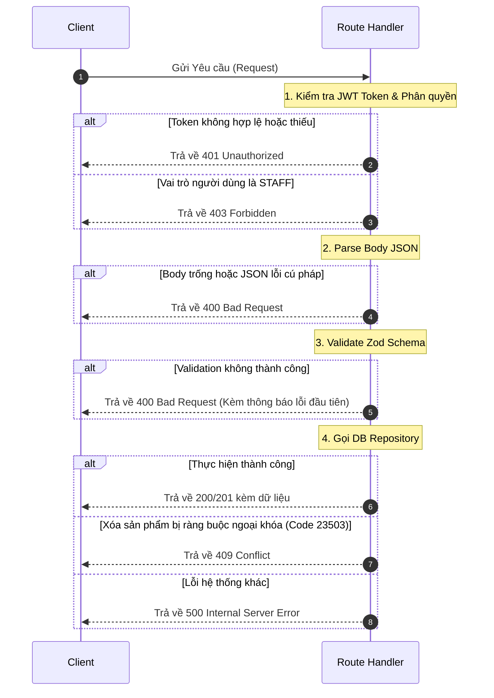

# Tài liệu Đặc tả RESTful Products API (v1)

Tài liệu này cung cấp chi tiết thiết kế, cấu trúc dữ liệu, và cách thức tương tác với RESTful Products API (phiên bản v1). API hỗ trợ đầy đủ các thao tác CRUD và được bảo mật chặt chẽ bằng phân quyền người dùng (Role-Based Access Control - RBAC).

---

## 1. Cấu trúc Response chuẩn hóa

Tất cả các phản hồi từ API đều tuân thủ cấu trúc JSON thống nhất:

### Phản hồi Thành công
```json
{
  "success": true,
  "data": { ... } // Đối tượng hoặc Mảng chứa dữ liệu trả về
}
```

### Phản hồi Thất bại
```json
{
  "success": false,
  "error": {
    "code": "BAD_REQUEST | UNAUTHORIZED | FORBIDDEN | NOT_FOUND | CONFLICT | INTERNAL_SERVER_ERROR",
    "message": "Thông điệp mô tả chi tiết lỗi."
  }
}
```

---

## 2. Bảo mật & Phân quyền (RBAC)

Các quyền hạn tương tác với API được quản lý trực tiếp bằng JWT Token của Supabase và được kiểm duyệt ở tầng Route Handler:
* **GET** (Xem thông tin): Cho phép tất cả các tài khoản (`STAFF`, `MANAGER`, `OWNER`) truy cập.
* **POST / PUT / PATCH / DELETE** (Ghi dữ liệu): Chỉ cho phép vai trò `OWNER` hoặc `MANAGER`.
  * Nếu người dùng có vai trò `STAFF`, API lập tức từ chối và trả về mã **`403 Forbidden`**.
  * Nếu không đính kèm token hợp lệ trong Header, API trả về mã **`401 Unauthorized`**.

---

## 3. Đặc tả Chi tiết các Endpoints

### 3.1. Lấy danh sách sản phẩm
* **Method & URL**: `GET /api/v1/products`
* **Phân quyền**: Tất cả vai trò
* **Query Parameters (Tùy chọn)**:
  * `onlyAvailable` (boolean): Nếu truyền `true`, chỉ trả về các sản phẩm còn hàng (`stock_quantity > 0`).
  * `search` (string): Tìm kiếm sản phẩm theo tên (không phân biệt hoa thường, hỗ trợ tìm kiếm một phần).
  * `status` (string, `ACTIVE` | `INACTIVE` | `ALL`): Mặc định là `ACTIVE` (chỉ lấy các sản phẩm đang hiển thị/hoạt động). Truyền `INACTIVE` để lấy sản phẩm đã ẩn, hoặc `ALL` để lấy toàn bộ.
* **Quy tắc Sắp xếp**: Mặc định sắp xếp theo tên sản phẩm (`product_name`) tăng dần.

#### Phản hồi mẫu (200 OK)
```json
{
  "success": true,
  "data": [
    {
      "id": "9b1deb4d-3b7d-4bad-9bdd-2b0d7b3dcb6d",
      "product_name": "Nước suối Aquafina 500ml",
      "unit_price": 10000,
      "stock_quantity": 48,
      "base_unit": "Chai",
      "is_packable": true,
      "pack_unit": "Thùng",
      "units_per_pack": 24,
      "pack_price": 220000,
      "status": "ACTIVE",
      "created_at": "2026-06-20T14:42:00.000Z"
    }
  ]
}
```

---

### 3.2. Tạo sản phẩm mới
* **Method & URL**: `POST /api/v1/products`
* **Phân quyền**: Chỉ `OWNER` hoặc `MANAGER`
* **Request Body (JSON)**:
  * Xem quy tắc Zod Schema Validation ở mục 4 bên dưới.

#### Phản hồi mẫu (201 Created)
```json
{
  "success": true,
  "data": {
    "id": "e305d045-8167-4bb9-bdff-83f1df7ef1bf",
    "product_name": "Nước ngọt Coca-Cola 330ml",
    "unit_price": 12000,
    "stock_quantity": 100,
    "base_unit": "Lon",
    "is_packable": true,
    "pack_unit": "Khay",
    "units_per_pack": 24,
    "pack_price": 270000,
    "status": "ACTIVE",
    "created_at": "2026-06-24T00:30:00.000Z"
  }
}
```

---

### 3.3. Lấy chi tiết sản phẩm
* **Method & URL**: `GET /api/v1/products/[productId]`
* **Phân quyền**: Tất cả vai trò

#### Phản hồi mẫu (200 OK)
```json
{
  "success": true,
  "data": {
    "id": "9b1deb4d-3b7d-4bad-9bdd-2b0d7b3dcb6d",
    "product_name": "Nước suối Aquafina 500ml",
    "unit_price": 10000,
    "stock_quantity": 48,
    "base_unit": "Chai",
    "is_packable": true,
    "pack_unit": "Thùng",
    "units_per_pack": 24,
    "pack_price": 220000,
    "status": "ACTIVE",
    "created_at": "2026-06-20T14:42:00.000Z"
  }
}
```
* **Lỗi 404 Not Found**: Trả về nếu không tồn tại sản phẩm với ID chỉ định.

---

### 3.4. Cập nhật toàn bộ sản phẩm (PUT)
* **Method & URL**: `PUT /api/v1/products/[productId]`
* **Phân quyền**: Chỉ `OWNER` hoặc `MANAGER`
* **Mô tả**: Dùng để cập nhật **toàn bộ** thông tin sản phẩm. Tất cả các trường bắt buộc của schema phải được gửi đầy đủ trong request body.
* **Lưu ý quan trọng**: Những trường tùy chọn (`optional`) nếu không truyền hoặc truyền `null` sẽ bị cập nhật về `null` trong database.

#### Phản hồi mẫu (200 OK)
```json
{
  "success": true,
  "data": {
    "id": "9b1deb4d-3b7d-4bad-9bdd-2b0d7b3dcb6d",
    "product_name": "Nước Aquafina 500ml (Cập nhật)",
    "unit_price": 11000,
    "stock_quantity": 48,
    "base_unit": "Chai",
    "is_packable": true,
    "pack_unit": "Thùng",
    "units_per_pack": 24,
    "pack_price": 220000,
    "status": "ACTIVE",
    "created_at": "2026-06-20T14:42:00.000Z"
  }
}
```

---

### 3.5. Cập nhật một phần sản phẩm (PATCH)
* **Method & URL**: `PATCH /api/v1/products/[productId]`
* **Phân quyền**: Chỉ `OWNER` hoặc `MANAGER`
* **Mô tả**: Dùng để cập nhật **một số** thuộc tính chỉ định. API chỉ validate các trường được gửi lên trong request body.
* **Cơ chế Soft Deactivation (Ẩn sản phẩm)**:
  * Khi sản phẩm đã phát sinh hóa đơn bán hàng, việc xóa vật lý (DELETE) sẽ bị chặn do ràng buộc ngoại khóa (ForeignKeyViolation - Lỗi 409).
  * Frontend nên gọi `PATCH` với payload `{ "status": "INACTIVE" }` để ẩn sản phẩm đi, đảm bảo tính toàn vẹn của dữ liệu lịch sử.

#### Yêu cầu mẫu (PATCH đổi trạng thái)
```json
{
  "status": "INACTIVE"
}
```

#### Phản hồi mẫu (200 OK)
```json
{
  "success": true,
  "data": {
    "id": "9b1deb4d-3b7d-4bad-9bdd-2b0d7b3dcb6d",
    "product_name": "Nước suối Aquafina 500ml",
    "unit_price": 10000,
    "stock_quantity": 48,
    "base_unit": "Chai",
    "is_packable": true,
    "pack_unit": "Thùng",
    "units_per_pack": 24,
    "pack_price": 220000,
    "status": "INACTIVE",
    "created_at": "2026-06-20T14:42:00.000Z"
  }
}
```

---

### 3.6. Xóa sản phẩm (DELETE)
* **Method & URL**: `DELETE /api/v1/products/[productId]`
* **Phân quyền**: Chỉ `OWNER` hoặc `MANAGER`

#### Lỗi 409 Conflict (Ràng buộc Ngoại khóa)
Nếu sản phẩm đã phát sinh giao dịch (nằm trong bất kỳ hóa đơn nào trong bảng `invoice_items`), hệ thống sẽ bắt lỗi vi phạm ràng buộc ngoại khóa từ Postgres (`23503`) và trả về lỗi chuẩn hóa thay vì lỗi thô:
```json
{
  "success": false,
  "error": {
    "code": "CONFLICT",
    "message": "Không thể xóa sản phẩm này vì đã có hóa đơn liên kết. Hãy ẩn sản phẩm thay vì xóa."
  }
}
```

---

## 4. Quy tắc Validation dữ liệu (Zod Schemas)

API sử dụng Zod để kiểm tra tính hợp lệ của dữ liệu đầu vào. Dưới đây là các ràng buộc chi tiết:

| Trường | Kiểu dữ liệu | Bắt buộc (POST/PUT) | Ràng buộc validation |
| :--- | :--- | :--- | :--- |
| `product_name` | string | **Có** | Không được để trống (sau khi loại bỏ khoảng trắng thừa) |
| `unit_price` | number | **Có** | Phải lớn hơn `0` |
| `stock_quantity` | number (int) | **Có** | Phải là số nguyên không âm (tối thiểu là `0`) |
| `base_unit` | string / null | Không | Mặc định là `null` hoặc tùy chọn chuỗi |
| `is_packable` | boolean | Không | Mặc định là `false`. Nếu là `true`, kích hoạt Ràng buộc đóng gói bên dưới. |
| `pack_unit` | string / null | Không* | Bắt buộc phải có giá trị chuỗi hợp lệ nếu `is_packable` là `true`. |
| `units_per_pack`| number (int) | Không* | Phải là số nguyên dương lớn hơn `0` (Bắt buộc nếu `is_packable` là `true`). |
| `pack_price` | number | Không* | Phải lớn hơn `0` (Bắt buộc nếu `is_packable` là `true`). |
| `status` | string | Không | Giá trị hợp lệ: `'ACTIVE'` hoặc `'INACTIVE'`. Mặc định khi tạo mới là `'ACTIVE'`. |

> [!IMPORTANT]
> **Ràng buộc đóng gói có điều kiện (Conditional Validation):**
> Trong các trường hợp `POST`, `PUT` và `PATCH` (khi `is_packable` được cập nhật thành `true`), Zod sẽ thực thi hàm `.refine()` để kiểm duyệt chéo: nếu sản phẩm hỗ trợ đóng gói (`is_packable: true`), ba trường đóng gói (`pack_unit`, `units_per_pack`, và `pack_price`) **bắt buộc** phải khác `null` hoặc `undefined`, ngược lại API sẽ trả về lỗi `400 Bad Request`.

---

## 5. Quy trình xử lý lỗi tại API (Flowchart)

Sơ đồ tuần tự xử lý yêu cầu và kiểm duyệt lỗi tại Route Handler của Next.js:


