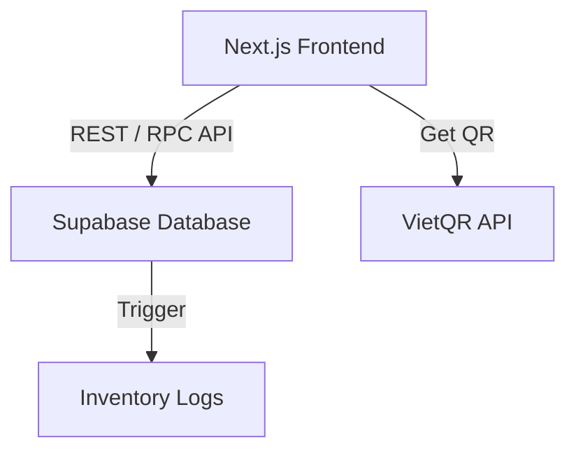
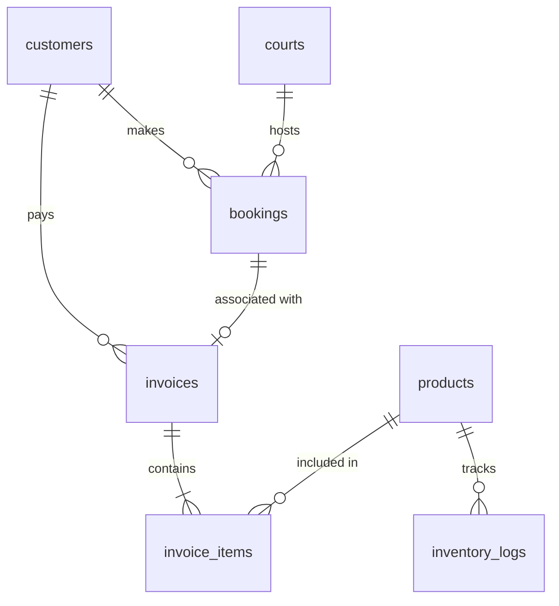

# System Architecture

This document describes the architectural patterns, database model, components, and integration strategies utilized in the Badminton Management System.

## Architecture Overview

The system is built as a modern, multi-tier web application:

1. **Frontend Layer**: Next.js 14 App Router, using React Server Components for data fetching and Client Components for interactive UI (shadcn/ui, Tailwind CSS).
2. **Database & Backend Layer (BaaS)**: Supabase (PostgreSQL) handles relational data, authentication, and low-level transaction logic via triggers and Database RPC functions.
3. **External Services**: Integrated VietQR API for generating dynamic payment QR codes.

## Database Schema & State Transitions

The core of the system relies on a set of tightly coupled tables. Below is the simplified Entity Relationship Diagram:

### Table Roles
- `bookings`: Stores reservations (`CONFIRMED`, `CHECKED_IN`, `COMPLETED`, `CANCELLED`).
- `invoices`: Tracks billing state (`is_paid = true/false`), payment method, and total amount.
- `invoice_items`: Records details of POS products/services sold under an invoice.
- `products`: Holds product details, base pricing, pack sizing (`units_per_pack`), and current `stock_quantity`.
- `inventory_logs`: Audits stock changes (RESTOCK, SALE, RETURN).

## Core Mechanisms

### 1. Auto-Inventory Sync (Trigger-Based)
To ensure stock consistency and avoid race conditions, the system delegates stock reduction and logging to a PostgreSQL trigger `trg_sync_inv` on the `invoice_items` table:
* On insertion or update of `invoice_items`, the trigger function calculates the difference (`delta_qty`).
* It automatically converts package sales (e.g. box of 12) to basic unit quantities if `is_pack_sold` is true, using `units_per_pack`.
* It updates `products.stock_quantity` and inserts audit rows into `inventory_logs`.
* See @doc/workflow/workflow-pos-service-ordering for details.

### 2. Transaction Integrity (RPCs)
For critical multi-table transactions, we use database functions (RPCs) to ensure atomicity:
* `check_in_booking`: Starts a session. Updates booking state to `CHECKED_IN`, calculates initial court fees, and creates a pending unpaid invoice (`is_paid = false`). Refer to @doc/workflow/workflow-booking-checkin.
* `close_booking_and_invoice`: Used in the day-end routine to close active sessions, calculate final fees, and log unpaid invoices as receivables (debt). Refer to @doc/workflow/workflow-debt-receivables.
