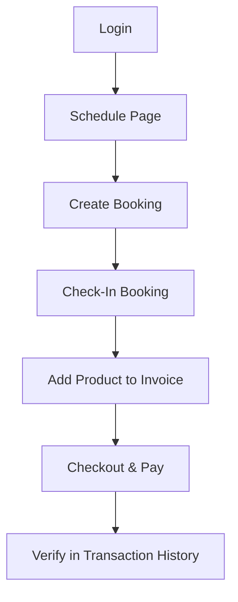

# E2E Test Plan - Booking to Invoice Workflow

This E2E test plan validates the critical path of the Badminton Management System, ensuring that all pieces of the refactored Data Access Layer (DAL) function correctly together in the browser.

---

## Scenario Overview: Booking to Invoice Lifecycle

---

## Detailed Test Steps

### Step 1: Authentication (Đăng nhập)
- **Action**: Navigate to `http://localhost:3000/login`.
- **Inputs**:
  - Email: `admin@horizonbadminton.com`
  - Password: `123456`
- **Verification**: User is redirected to `/` (Home Dashboard) and Sidebar navigation displays the owner/admin menu.

### Step 2: Navigate to Schedule (Lịch Đặt Sân)
- **Action**: Click the "Lịch Đặt Sân" link on the Sidebar or navigate directly to `http://localhost:3000/schedule`.
- **Verification**: The court timeline shows the list of courts ("Sân 1", "Sân 2") and time slots.

### Step 3: Create a Court Booking (Đặt Sân Mới)
- **Action**: 
  - Click the floating Action Button `(+)` to open the booking dialog.
  - Select Court: "Sân 1".
  - Select Customer: "Khách hàng Test 1" (or select from the dropdown list).
  - Set Start Time: current hour (e.g. `14:00`).
  - Set Duration: `1` hour.
  - Click "Đặt sân" to submit.
- **Verification**: The booking form closes, and the new booking slot is rendered on the timeline under "Sân 1".

### Step 4: Check-In (Nhận Sân)
- **Action**:
  - Click on the newly created booking slot in the timeline to open "Chi tiết đặt sân".
  - Click the "Check In (Nhận Sân)" button.
- **Verification**: The dialog reloads, status changes to "ĐANG SỬ DỤNG" (CHECKED_IN), and the service order menu (Dịch vụ / Menu) becomes active.

### Step 5: Add Service Item to Invoice (Thêm Dịch Vụ)
- **Action**:
  - In the "Dịch vụ / Menu" section, select "Nước khoáng Lavie 500ml" (10.000 ₫) from the select list.
  - Click the `(+)` button to add the item.
- **Verification**: The item is appended to the invoice summary, and the total amount increases by 10.000 ₫.

### Step 6: Checkout and Payment (Thanh toán & Trả sân)
- **Action**:
  - Click the "Thanh toán & Trả sân" button to load the Checkout Form.
  - Select Payment Method: "Chuyển khoản" (BANK_TRANSFER).
  - Click the "Thanh toán" button to complete.
- **Verification**: The checkout succeeds, dialog closes, the court status updates to available (ready for next bookings), and local state synchronizes.

### Step 7: Verification in Transaction History (Sổ Thu Chi)
- **Action**: Navigate to `http://localhost:3000/invoices`.
- **Verification**: 
  - Toggle to the "Lịch Sử Giao Dịch" tab.
  - Locate the latest transaction. It must show:
    - Customer Name: "Khách hàng Test 1"
    - Status: "Đã thanh toán"
    - Details: "Sân 1 • 1.0 giờ"
    - Correct total amount reflecting both the court rent and the added water bottle.
