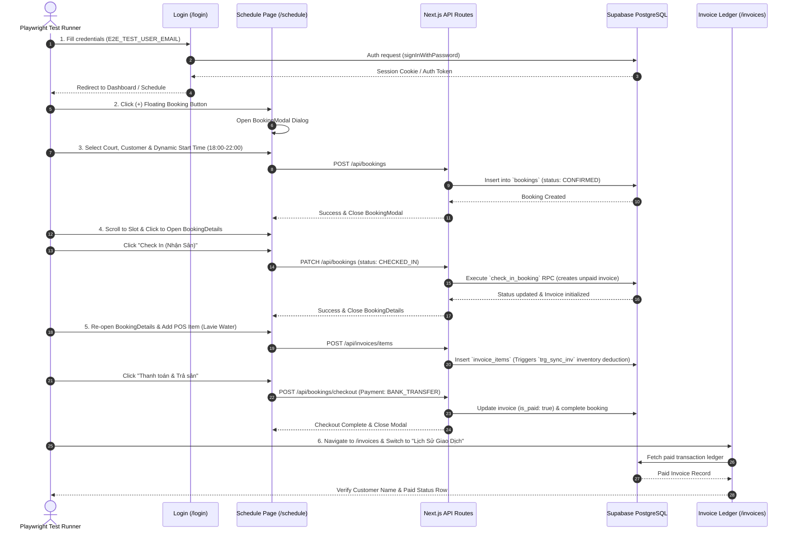

# P0 Booking-to-Invoice Lifecycle E2E Test Workflow

This document provides a comprehensive technical breakdown of the **P0 Booking-to-Invoice Lifecycle** automated End-to-End (E2E) test suite using Playwright and the Page Object Model (POM) architecture.

---

## 📐 1. System Architecture & Test Scope

The E2E test validates the core revenue-generating lifecycle of the Badminton Management System across all layers:
- **Frontend UI**: Next.js App Router (Client & Server Components, Radix UI modals).
- **Backend API Routes**: `/api/bookings`, `/api/invoices/items`, `/api/bookings/checkout`.
- **Database Layer**: Supabase PostgreSQL triggers (`trg_sync_inv` stock deduction) and RPCs (`check_in_booking`).

---

## 🔄 2. End-to-End Sequence Diagram

---

## 📝 3. Detailed Step-by-Step Workflow

### Step 1: Authentication (`LoginPage.ts`)
- **Action**: Navigates to `/login`, reads `process.env.E2E_TEST_USER_EMAIL` and `process.env.E2E_TEST_USER_PASSWORD` from `.env.local` or GitHub Secrets, and submits form.
- **Verification**: `expect(page).not.toHaveURL(/\/login/)` verifies successful redirection away from login. Includes error banner detection (`.text-red-700`) to report invalid credentials instantly.

### Step 2: Schedule Timeline Navigation (`SchedulePage.ts`)
- **Action**: Navigates to `/schedule`.
- **Verification**: Confirms timeline header `"Lịch đặt sân"` is visible.

### Step 3: Court Booking Creation (`BookingModal.ts`)
- **Action**: Clicks floating `(+)` action button to open `BookingForm`.
  - Selects Court (`Sân 1` or specified court).
  - Selects Customer (`Khách vãng lai`).
  - Sets dynamic evening start time (randomized `18:00–22:00` to prevent slot collisions).
  - Triggers React `change` event on `input#startTime`.
- **Verification**: Submits form and verifies `submitBtn` becomes hidden (`toBeHidden()`).

### Step 4: Booking Check-In (`CheckoutModal.ts` / `BookingDetails.tsx`)
- **Action**: Calls `schedulePage.clickBookingSlot()` (uses `scrollIntoViewIfNeeded()` to bring slot into view), then clicks `"Check In (Nhận Sân)"`.
- **Verification**: API executes `check_in_booking` RPC. `onCheckInSuccess()` automatically closes `BookingDetails` dialog (`expect(checkInBtn).toBeHidden()`).

### Step 5: Service Ordering & Payment Checkout (`CheckoutModal.ts`)
- **Action**: Re-opens the checked-in booking slot on timeline.
  - Adds POS item (e.g. Lavie mineral water).
  - Clicks `"Thanh toán & Trả sân"`.
  - Selects payment method (`Chuyển khoản` / Bank Transfer).
  - Confirms payment.
- **Verification**: Verifies checkout modal completes and closes cleanly.

### Step 6: Invoice Ledger Audit (`InvoiceHistoryPage.ts`)
- **Action**: Navigates to `/invoices` and switches to `"Lịch Sử Giao Dịch"` tab.
- **Verification**: Asserts the transaction row displaying the customer name is visible and marked as paid.

---

## 🛠️ 4. Page Object Model (POM) Class Mapping

| Page Object Class | File Path | Responsibilities |
| :--- | :--- | :--- |
| `LoginPage` | [LoginPage.ts](file:///d:/BadmintonManagement/e2e/pages/LoginPage.ts) | Encapsulates `/login` form inputs, environment variable reading, and auth assertions. |
| `SchedulePage` | [SchedulePage.ts](file:///d:/BadmintonManagement/e2e/pages/SchedulePage.ts) | Encapsulates timeline view, `(+)` FAB button, slot scrolling, and slot selection. |
| `BookingModal` | [BookingModal.ts](file:///d:/BadmintonManagement/e2e/pages/BookingModal.ts) | Encapsulates `BookingForm` selects, React input change events, and submit validation. |
| `CheckoutModal` | [CheckoutModal.ts](file:///d:/BadmintonManagement/e2e/pages/CheckoutModal.ts) | Encapsulates check-in action, POS item addition, payment selector, and checkout confirmation. |
| `InvoiceHistoryPage` | [InvoiceHistoryPage.ts](file:///d:/BadmintonManagement/e2e/pages/InvoiceHistoryPage.ts) | Encapsulates `/invoices` tab navigation and transaction ledger verification assertions. |

---

## ⚡ 5. Resiliency & Self-Healing Design

1. **Conflict-Free Slot Generation**: Start times are dynamically calculated per run to ensure tests can be executed repeatedly on the same day without colliding with pre-existing bookings.
2. **React Controlled Input Sync**: Explicitly dispatches `change` events on HTML5 time inputs to sync React state (`setStartTime`).
3. **Auto-Scrolling Locators**: Uses `scrollIntoViewIfNeeded()` before clicking timeline booking cards to prevent off-screen click failures.
4. **Server Error Surface via `Promise.race`**: If a server error occurs during form submission (e.g., 409 Conflict), Playwright detects the `.bg-red-50` banner and prints the exact backend error immediately instead of hitting a 10-second timeout.
