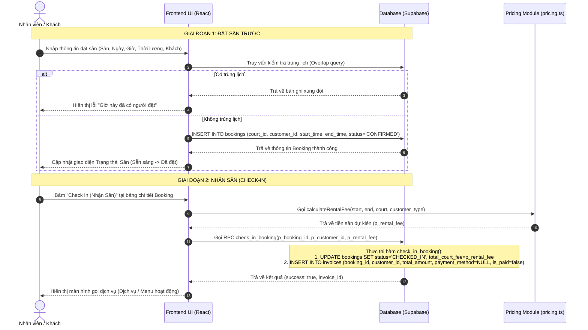

# Quy trình Đặt Sân & Nhận Sân (Booking & Check-in Workflow)

Tài liệu này mô tả chi tiết nghiệp vụ, luồng xử lý dữ liệu và cấu trúc mã nguồn liên quan đến quy trình đặt sân trước và làm thủ tục nhận sân (Check-in) tại câu lạc bộ cầu lông.

---

## 1. Tổng quan Nghiệp vụ

Quy trình này gồm hai giai đoạn chính:
1. **Đặt Sân (Booking Reservation)**: Cho phép khách hàng (hoặc nhân viên đặt giúp) giữ chỗ sân đấu vào một khung giờ nhất định trong tương lai. Hệ thống sẽ kiểm tra xung đột thời gian trên sân đó để tránh đặt trùng. Trạng thái ban đầu của đặt lịch là `CONFIRMED`.
2. **Nhận Sân (Check-in)**: Khi khách hàng đến giờ chơi, nhân viên thực hiện Check-in nhận sân. Lúc này hệ thống sẽ tính phí thuê sân dự kiến dựa trên bảng giá sân, thời lượng chơi, và loại khách hàng (Vãng lai hay Thân thiết), đồng thời tự động khởi tạo hóa đơn tạm tính ở trạng thái chưa thanh toán (`is_paid = false`) gắn liền với lượt đặt sân này.

---

## 2. Biểu đồ Luồng Xử lý (Workflow Diagram)

---

## 3. Các Tập tin Mã nguồn Liên quan

### A. Giao diện & Xử lý Client
- **[booking-form.tsx](file:///d:/BadmintonManagement/src/components/booking/booking-form.tsx)**:
  - Form thu thập dữ liệu khách hàng (sử dụng Combobox chọn khách hàng hiện có, tự động fallback tạo "Khách vãng lai" nếu không chọn).
  - Thực hiện kiểm tra trùng giờ đặt lịch bằng cách so sánh thời gian `start_time` and `end_time` với các bản ghi không ở trạng thái `CANCELLED` trên cùng sân `court_id`.
  - Thực hiện `INSERT` bản ghi mới vào bảng `bookings` với trạng thái `CONFIRMED`.
- **[booking-details.tsx](file:///d:/BadmintonManagement/src/components/booking/booking-details.tsx)**:
  - Hiển thị thông tin chi tiết của một lịch đặt sân.
  - Chứa nút kích hoạt chức năng **Check In (Nhận Sân)**.
  - Sử dụng hàm tính tiền sân dự kiến `calculateRentalFee` và gửi tham số này vào hàm RPC `check_in_booking` của Supabase.

### B. Logic Tính giá & Cơ sở Dữ liệu
- **[pricing.ts](file:///d:/BadmintonManagement/src/lib/pricing.ts)**:
  - Hàm `calculateRentalFee` nhận vào thời gian bắt đầu, thời gian kết thúc, cấu hình giá của sân, và loại khách hàng (`LOYAL` hoặc `GUEST`).
  - Phân tách thời gian thuê thành giờ sáng (Morning) và giờ tối (Evening) vì giá thuê sân cầu lông thường khác nhau giữa hai khung giờ này, sau đó áp giá tương ứng với loại khách hàng để ra tổng số tiền.
- **[20260224154854_add_check_in_booking.sql](file:///d:/BadmintonManagement/supabase/migrations/20260224154854_add_check_in_booking.sql)**:
  - Định nghĩa hàm PostgreSQL `check_in_booking`.
  - Cập nhật trạng thái đặt sân của booking sang `CHECKED_IN`.
  - Tạo mới một bản ghi hóa đơn (`invoices`) liên kết với booking này với tổng số tiền bằng tiền sân dự kiến, đảm bảo hóa đơn bắt đầu tích lũy chi phí.

---

## 4. Chi tiết Dữ liệu Thay đổi (Database State)

| Bảng dữ liệu | Thao tác | Thay đổi trạng thái / Giá trị cột |
| :--- | :--- | :--- |
| **bookings** | INSERT | Tạo lịch hẹn: `status = 'CONFIRMED'`, `deposit_amount = [tiền cọc nếu có]` |
| **bookings** | UPDATE | Nhận sân chơi: `status = 'CHECKED_IN'`, `total_court_fee = [tiền sân dự kiến]` |
| **invoices** | INSERT | Tạo hóa đơn tạm tính: `booking_id = [id]`, `total_amount = [tiền sân]`, `is_paid = false`, `payment_method = NULL` |
