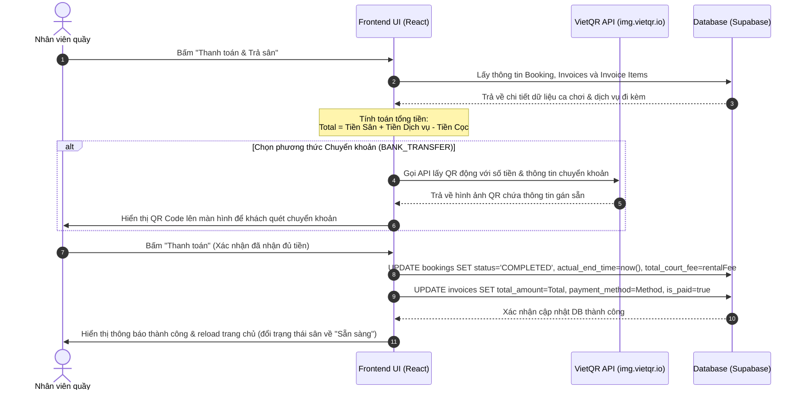

# Quy trình Trả Sân & Thanh toán (Checkout & Payment Workflow)

Tài liệu này mô tả chi tiết nghiệp vụ tính toán chi phí tổng hợp, phương thức thanh toán tiền mặt/chuyển khoản, tích hợp mã QR động và các thao tác cập nhật cơ sở dữ liệu khi kết thúc ca chơi cầu lông.

---

## 1. Tổng quan Nghiệp vụ

Khi khách hàng chơi xong và thực hiện trả sân, nhân viên sẽ kích hoạt luồng **Thanh toán & Trả Sân**. Quy trình này thực hiện các bước:
1. **Tính toán chi phí**: Tổng hợp chi phí dựa trên:
   - **Tiền sân**: Thời gian đặt lịch thực tế nhân với đơn giá giờ (áp dụng giá sáng/tối và giá thân thiết/vãng lai).
   - **Tiền dịch vụ (POS)**: Tổng tiền các sản phẩm ăn uống, phụ kiện khách đã gọi trong ca.
   - **Phí quá giờ (Overtime)**: Phí phát sinh nếu khách chơi quá giờ đã đặt trước (cột lưu trữ có sẵn, hiện tại tính = 0 làm mặc định).
   - **Khoản khấu trừ**: Trừ đi tiền cọc trước của khách hàng (`deposit_amount`).
2. **Lựa chọn thanh toán**:
   - **Tiền mặt**: Khách đưa tiền mặt tại quầy.
   - **Chuyển khoản**: Hệ thống sinh ra **Mã VietQR động** chứa chính xác thông tin số tài khoản của câu lạc bộ, số tiền cần thanh toán và nội dung chuyển khoản rõ ràng.
3. **Hoàn tất ca chơi**: Sau khi xác nhận thanh toán thành công, đặt sân chuyển sang trạng thái `COMPLETED` và hóa đơn được đóng trạng thái `is_paid = true`.

---

## 2. Biểu đồ Luồng Xử lý (Workflow Diagram)

---

## 3. Các Tập tin Mã nguồn Liên quan

### A. Giao diện & Xử lý Thanh toán
- **[checkout-form.tsx](file:///d:/BadmintonManagement/src/components/booking/checkout-form.tsx)**:
  - Tải thông tin đặt sân, hóa đơn đang mở và chi tiết các món hàng dịch vụ bán kèm.
  - Áp dụng các công thức tính toán chi phí cuối cùng ở phía client.
  - Chứa bộ nút chuyển đổi phương thức thanh toán (`CASH` hoặc `BANK_TRANSFER`).
  - **Tích hợp VietQR**: Tạo thẻ `Image` hiển thị mã QR động thông qua dịch vụ `https://img.vietqr.io/image/...` tích hợp thông tin tài khoản (TPBank), số tiền cần thanh toán chính xác, nội dung chuyển khoản tự động định dạng `Thanh toan san [Court Name]`.
  - Thực hiện hai tác vụ cập nhật Supabase song song khi bấm xác nhận:
    1. Cập nhật bảng `bookings`: đặt `status = 'COMPLETED'`, ghi nhận giờ trả sân thực tế `actual_end_time` và cập nhật chi phí sân thực nhận.
    2. Cập nhật bảng `invoices`: đặt `is_paid = true`, lưu tổng tiền thanh toán và phương thức thanh toán.

### B. Logic Phụ trợ
- **[pricing.ts](file:///d:/BadmintonManagement/src/lib/pricing.ts)**:
  - Hàm `calculateRentalFee` được gọi lại để đảm bảo tính đúng chi phí sân thực tế trước khi xuất hóa đơn thanh toán.
- **[utils.ts](file:///d:/BadmintonManagement/src/lib/utils.ts)**:
  - Hàm `formatCurrency` để hiển thị số tiền thanh toán theo đúng định dạng tiền tệ Việt Nam (VND).

---

## 4. Chi tiết Dữ liệu Thay đổi (Database State)

| Bảng dữ liệu | Thao tác | Thay đổi trạng thái / Giá trị cột |
| :--- | :--- | :--- |
| **bookings** | UPDATE | Đóng ca chơi: `status = 'COMPLETED'`, `actual_end_time = [giờ hiện tại]`, `total_court_fee = [phí sân thực tế]`. |
| **invoices** | UPDATE | Ghi nhận thanh toán: `is_paid = true`, `total_amount = [tổng tiền cuối]`, `payment_method = 'CASH' \| 'BANK_TRANSFER'`. |
