# Quy trình Quản lý Công Nợ & Chốt Ca Cuối Ngày (Debt & Day-End Workflow)

Tài liệu này mô tả chi tiết nghiệp vụ theo dõi công nợ khách hàng, đối soát lịch sử thu chi và cơ chế tự động kết xuất hóa đơn khi chốt ca cuối ngày nhằm tránh thất thoát doanh thu sân đấu.

---

## 1. Tổng quan Nghiệp vụ

Đặc thù câu lạc bộ thể thao thường cho phép khách hàng quen ghi nợ chi phí chơi sân hoặc tiền nước uống để thanh toán gộp cuối tháng. Hệ thống hỗ trợ:
1. **Sổ Thu Chi (Invoices Ledger)**: Phân tách thành 2 chế độ xem:
   - **Công Nợ (Receivables)**: Gom nhóm tất cả hóa đơn chưa thanh toán theo từng khách hàng. Cho phép xem chi tiết từng hóa đơn nợ và bấm **Thu Nợ Nhanh** gộp tất cả hóa đơn nợ của khách đó.
   - **Lịch Sử Giao Dịch (Transaction History)**: Nhật ký hiển thị các hóa đơn đã thanh toán theo trình tự thời gian, hỗ trợ lọc theo ngày.
2. **Chốt Ca Cuối Ngày (Day-End Close)**: Cuối ngày, nhân viên nhấn nút "Kết thúc ngày". Hệ thống tự động quét toàn bộ ca chơi đang hoạt động (`CHECKED_IN`) hoặc đã đặt lịch nhưng chưa làm thủ tục thanh toán (`CONFIRMED`), tự động chốt giờ theo lịch hẹn, tính tiền sân, đổi trạng thái booking thành `COMPLETED` và kết xuất hóa đơn nợ (`is_paid = false`) tương ứng với khách hàng để tránh bỏ quên doanh thu.

---

## 2. Biểu đồ Luồng Xử lý (Workflow Diagram)

```mermaid
flowchart TD
    subgraph Giai đoạn Thu Nợ Gộp
        A[Nhân viên bấm Thu Nợ tại dòng Khách Hàng] --> B[Hiển thị Dialog chọn Chuyển khoản / Tiền mặt]
        B --> C[Xác nhận Thu Nợ]
        C --> D[Gọi API POST /api/invoices/pay-all]
        D --> E[UPDATE invoices SET is_paid=true, payment_method=Method WHERE customer_id=id AND is_paid=false]
        E --> F[Tải lại danh sách công nợ trên UI]
    end

    subgraph Quy trình Chốt Ca Cuối Ngày
        1[Bấm 'Kết thúc ngày' trên giao diện] --> 2[Gọi API POST /api/invoices/auto-generate]
        2 --> 3[Lọc danh sách Bookings trong ngày có status CONFIRMED hoặc CHECKED_IN]
        3 --> 4[Loại bỏ các bookings đã có hóa đơn liên kết]
        4 --> 5[Vòng lặp chạy qua từng Booking chưa chốt]
        5 --> 6[Tính tiền sân dự kiến theo lịch hẹn]
        6 --> 7[Gọi RPC close_booking_and_invoice]
        7 --> 8[Database: Cập nhật booking sang COMPLETED và tạo hóa đơn tạm nợ is_paid=false]
        8 --> 9[Trả về số lượng hóa đơn tự động tạo lập]
    end
```

---

## 3. Các Tập tin Mã nguồn Liên quan

### A. Giao diện Sổ Thu Chi
- **[page.tsx](file:///d:/BadmintonManagement/src/app/invoices/page.tsx)**:
  - Điều khiển chuyển đổi trạng thái Tab (`RECEIVABLES` hoặc `TRANSACTIONS`).
  - Chứa nút **"Kết thúc ngày"** (gọi API `/api/invoices/auto-generate`).
- **[receivables-ledger.tsx](file:///d:/BadmintonManagement/src/components/invoices/receivables-ledger.tsx)**:
  - Tải tất cả hóa đơn chưa thanh toán (`is_paid = false`) và thực hiện gom nhóm thủ công ở client theo `customer_id`.
  - Tính tổng nợ của từng khách hàng, sắp xếp theo thứ tự nợ từ nhiều đến ít.
  - Hiển thị nút Thu Nợ và Dialog xác nhận, sau đó gọi API `/api/invoices/pay-all`.

### B. Xử lý API & Cơ sở Dữ liệu
- **[pay-all/route.ts](file:///d:/BadmintonManagement/src/app/api/invoices/pay-all/route.ts)**:
  - API xử lý gộp thanh toán.
  - Thực hiện cập nhật hàng loạt cột `is_paid = true` cho tất cả hóa đơn thuộc về `customer_id` được gửi lên.
- **[auto-generate/route.ts](file:///d:/BadmintonManagement/src/app/api/invoices/auto-generate/route.ts)**:
  - Tải danh sách đặt sân trong ngày có trạng thái mở.
  - Tính phí sân dự kiến bằng hàm `calculateRentalFee`.
  - Gọi hàm RPC PostgreSQL `close_booking_and_invoice` để kết xuất hóa đơn nợ cho từng ca chơi.
- **[20260224133446_add_close_booking_and_invoice.sql](file:///d:/BadmintonManagement/supabase/migrations/20260224133446_add_close_booking_and_invoice.sql)**:
  - Định nghĩa hàm SQL `close_booking_and_invoice`.
  - Thực hiện kiểm tra trùng lặp hóa đơn, tạo hóa đơn mới với `is_paid = false`, đồng thời chuyển trạng thái đặt sân của booking tương ứng sang `COMPLETED`.

---

## 4. Chi tiết Dữ liệu Thay đổi (Database State)

| Bảng dữ liệu | Thao tác | Thay đổi trạng thái / Giá trị cột |
| :--- | :--- | :--- |
| **invoices** | UPDATE (Thu Nợ) | Ghi nhận trả nợ: `is_paid = true`, `payment_method = 'CASH' \| 'BANK_TRANSFER'` trên tất cả bản ghi được lọc. |
| **invoices** | INSERT (Chốt ngày) | Sinh hóa đơn nợ tự động: `booking_id = [id]`, `total_amount = [tiền sân tính theo lịch]`, `is_paid = false`, `payment_method = NULL`. |
| **bookings** | UPDATE (Chốt ngày) | Chốt ca tự động: `status = 'COMPLETED'`, `actual_end_time = [giờ kết thúc lịch đặt]`, `total_court_fee = [phí sân tính theo lịch]`. |
