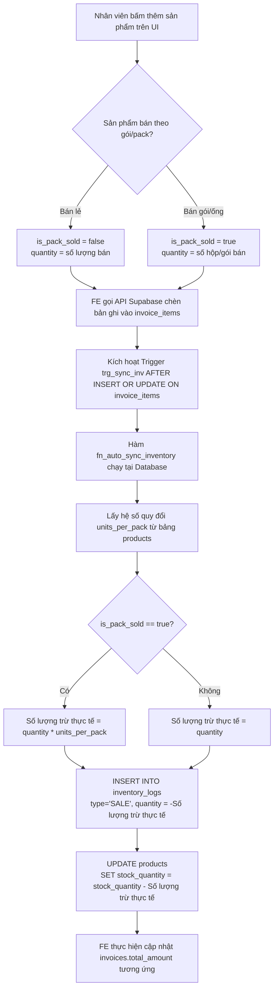

# Quy trình Gọi Dịch vụ & Trừ Kho Tự động (POS & Inventory Sync Workflow)

Tài liệu này mô tả chi tiết nghiệp vụ, luồng xử lý dữ liệu và cơ chế đồng bộ kho tự động ở cấp cơ sở dữ liệu khi nhân viên gọi dịch vụ (nước uống, cầu lông, thuê vợt...) cho khách hàng đang sử dụng sân.

---

## 1. Tổng quan Nghiệp vụ

Trong lúc khách hàng đang sử dụng sân (Booking có trạng thái `CHECKED_IN`), họ có thể yêu cầu thêm các dịch vụ ăn uống hoặc mua/thuê các trang thiết bị tại quầy. 
- **Gọi món/dịch vụ**: Nhân viên thao tác thêm sản phẩm ngay tại màn hình Chi tiết sân đang sử dụng. 
- **Quy đổi đơn vị**: Hệ thống hỗ trợ bán lẻ (đơn vị cơ sở, ví dụ: quả cầu lẻ, chai nước) hoặc bán theo gói/hộp (ví dụ: ống cầu, thùng nước).
- **Trừ kho tự động**: Khi sản phẩm được thêm vào hóa đơn, cơ sở dữ liệu Supabase sẽ kích hoạt trigger để tự động trừ số lượng tồn kho của sản phẩm đó dựa theo đơn vị cơ sở nhỏ nhất, đồng thời ghi lại nhật ký kho (`inventory_logs`) để tiện cho việc đối soát.

---

## 2. Biểu đồ Luồng Xử lý (Workflow Diagram)

---

## 3. Các Tập tin Mã nguồn Liên quan

### A. Giao diện POS & Cập nhật Client
- **[booking-details.tsx](file:///d:/BadmintonManagement/src/components/booking/booking-details.tsx)**:
  - Hiển thị danh mục sản phẩm còn hàng (`stock_quantity > 0`).
  - Xử lý việc gom nhóm đơn vị bán lẻ (ví dụ: quả cầu lông lẻ giá `unit_price`) và đơn vị đóng gói (ví dụ: ống cầu lông 12 quả giá `pack_price`), truyền cờ `isPack` sang cơ sở dữ liệu.
  - Gọi các câu lệnh `insert`/`update`/`delete` trực tiếp lên bảng `invoice_items`.
  - Cập nhật số tiền `total_amount` trên bảng `invoices` khi thêm/sửa/xóa sản phẩm.
  - Thực hiện logic hoàn trả kho thủ công khi xóa hẳn sản phẩm khỏi hóa đơn bằng cách ghi nhật ký `RETURN` và cộng lại tồn kho (dòng 290-330).

### B. Kích hoạt và Xử lý Cơ sở Dữ liệu (Supabase Triggers)
- **[20240101000000_initial_schema.sql](file:///d:/BadmintonManagement/supabase/migrations/20240101000000_initial_schema.sql)**:
  - **Trigger `trg_sync_inv`** (dòng 340): Được định nghĩa chạy `AFTER INSERT OR UPDATE ON public.invoice_items FOR EACH ROW` để kích hoạt hàm `fn_auto_sync_inventory`.
  - **Hàm `fn_auto_sync_inventory`** (dòng 96-145):
    - Tính toán lượng chênh lệch sản phẩm (`delta_qty = NEW.quantity - OLD.quantity` hoặc `NEW.quantity`).
    - Quy đổi về đơn vị cơ sở nhỏ nhất: Nếu `NEW.is_pack_sold = true`, nhân `delta_qty` với `units_per_pack` lấy từ bảng `products`.
    - Thực hiện ghi nhận nhật ký xuất kho trong bảng `inventory_logs` với số lượng âm (`-v_actual_deduction`).
    - Cập nhật trực tiếp số lượng tồn kho cơ sở tại cột `stock_quantity` của bảng `products`.

---

## 4. Chi tiết Dữ liệu Thay đổi (Database State)

| Bảng dữ liệu | Thao tác | Thay đổi trạng thái / Giá trị cột |
| :--- | :--- | :--- |
| **invoice_items** | INSERT / UPDATE | Chèn sản phẩm bán kèm: lưu `invoice_id`, `product_id`, `quantity`, `sale_price` và cờ `is_pack_sold`. |
| **invoices** | UPDATE | Cập nhật tổng tiền: `total_amount = total_amount + (giá bán * số lượng đổi)`. |
| **inventory_logs** | INSERT | DB tự tạo nhật ký xuất kho: `type = 'SALE'`, `quantity = -[số lượng quy đổi ra đơn vị cơ sở]`, `related_invoice_id = [id hóa đơn]`. |
| **products** | UPDATE | DB tự động giảm kho: `stock_quantity = stock_quantity - [số lượng quy đổi ra đơn vị cơ sở]`. |
