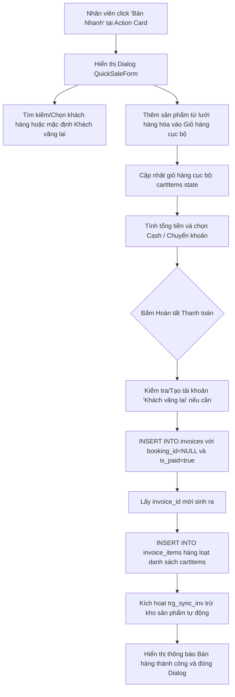

# Quy trình Bán Hàng Lẻ / Bán Nhanh (Quick Sale Workflow)

Tài liệu này mô tả chi tiết nghiệp vụ bán lẻ hàng hóa, dịch vụ trực tiếp cho khách vãng lai hoặc khách thành viên mà không qua luồng đặt sân và nhận sân truyền thống.

---

## 1. Tổng quan Nghiệp vụ

Tính năng **Bán Nhanh (Quick Sale)** phục vụ nhu cầu mua nước uống, thuê bóng cầu lông trực tiếp tại quầy của khách hàng vãng lai không đặt sân.
- **Giỏ hàng Cục bộ**: Nhân viên chọn sản phẩm và điều chỉnh số lượng tăng/giảm. Dữ liệu này được quản lý bằng React State cục bộ (`cartItems`) trước khi tạo bản ghi thực tế trên cơ sở dữ liệu.
- **Xác định khách hàng**: Khách hàng có thể được tìm kiếm qua thanh chọn. Nếu không chọn, hệ thống tự động gán cho **"Khách vãng lai"** (tự động tạo bản ghi này nếu chưa tồn tại).
- **Giao dịch Đồng thời**: Khi nhấn "Thanh toán", hệ thống tạo đồng thời hóa đơn `invoices` (với cờ `booking_id = null` và `is_paid = true`) và danh sách mặt hàng `invoice_items`.
- **Trừ kho tự động**: Trigger cơ sở dữ liệu tự động trừ hàng trong kho ngay sau khi các bản ghi `invoice_items` được chèn vào DB.

---

## 2. Biểu đồ Luồng Xử lý (Workflow Diagram)

---

## 3. Các Tập tin Mã nguồn Liên quan

### A. Giao diện Giỏ hàng & Thanh toán
- **[quick-actions.tsx](file:///d:/BadmintonManagement/src/components/home/quick-actions.tsx)**:
  - Nút **"Bán nhanh"** trên bảng điều khiển trang chủ điều khiển trạng thái mở `isQuickSaleOpen` của Dialog.
- **[quick-sale-form.tsx](file:///d:/BadmintonManagement/src/components/booking/quick-sale-form.tsx)**:
  - Quản lý trạng thái giỏ hàng cục bộ `cart` chứa danh sách mặt hàng và số lượng đã chọn.
  - Sử dụng Combobox tìm kiếm khách hàng nhanh (hỗ trợ nhập số điện thoại hoặc tên).
  - Tích hợp biểu mẫu chọn hình thức thanh toán (Tiền mặt/Chuyển khoản) và liên kết mã QR VietQR giống như màn hình Checkout trả sân.
  - Chạy quy trình chèn cơ sở dữ liệu tuần tự:
    1. Kiểm tra/Tạo "Khách vãng lai" trong bảng `customers`.
    2. Chèn hóa đơn đã thanh toán vào bảng `invoices` (`booking_id = null`, `is_paid = true`).
    3. Lấy `id` hóa đơn vừa tạo để chèn hàng loạt (Bulk Insert) chi tiết vào bảng `invoice_items`.
  - Hiển thị màn hình thành công ngắn gọn trước khi tự động đóng popup và cập nhật lại doanh thu trang chủ.

### B. Đồng bộ Dữ liệu Cấp Thấp
- **Bảng `products` & Bảng `invoice_items`**:
  - Dựa hoàn toàn vào trigger `trg_sync_inv` được định nghĩa trong [20240101000000_initial_schema.sql](file:///d:/BadmintonManagement/supabase/migrations/20240101000000_initial_schema.sql) để tự động trừ kho hàng hóa mà không cần viết lệnh SQL trừ kho thủ công trong mã nguồn TypeScript.

---

## 4. Chi tiết Dữ liệu Thay đổi (Database State)

| Bảng dữ liệu | Thao tác | Thay đổi trạng thái / Giá trị cột |
| :--- | :--- | :--- |
| **customers** | INSERT | Tự tạo "Khách vãng lai" nếu cơ sở dữ liệu chưa có bản ghi này (thường chạy 1 lần duy nhất). |
| **invoices** | INSERT | Tạo hóa đơn bán lẻ: `booking_id = NULL`, `total_amount = totalAmount`, `payment_method = 'CASH' \| 'BANK_TRANSFER'`, `is_paid = true`. |
| **invoice_items** | INSERT (Bulk) | Tạo chi tiết hàng lẻ: chèn danh sách các bản ghi tương ứng với giỏ hàng. |
| **products** | UPDATE | DB tự động giảm kho dựa trên trigger đồng bộ. |
